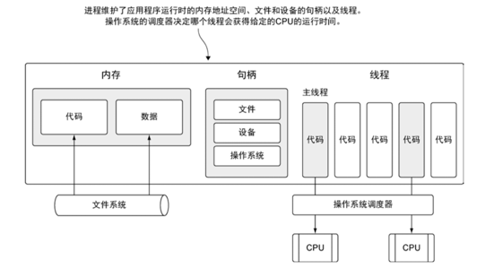
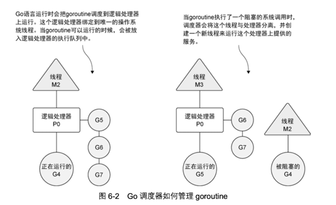
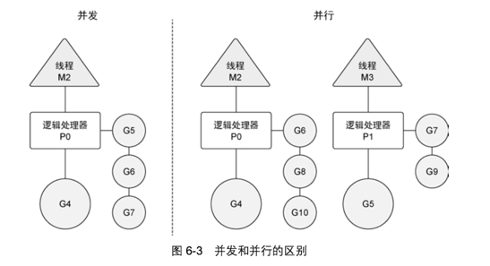
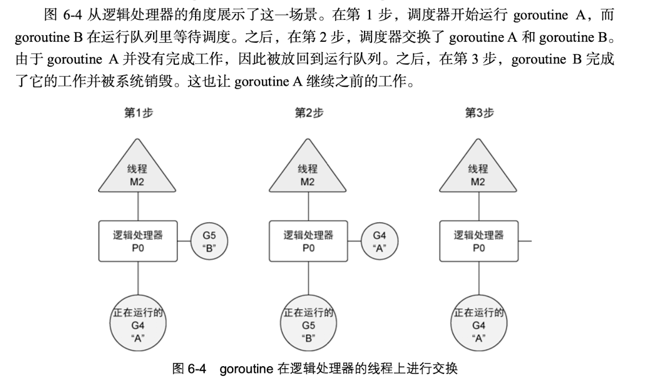
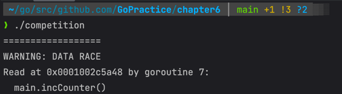

## 并发
- 使用goroutine运行程序
- 检测并修正竞争关系
- 利用通道共享数据

### 背景
1. Web服务器需要在各自独立的socket上同时处理多个数据请求；每个socket请求都是独立的，完全可以独立于其他socket进行处理。
2. Go语言力的并发指的是能让某个函数独立于其他函数运行的能力。
3. 当一个函数创建为goroutine时，Go会将其视为一个独立的工作单元。这个单元会被调度到可用的逻辑处理器上执行。
4. Go语言的并发同步模型来自一个叫通信顺序进程（CSP）的泛型。CSP是一种消息传递模型，通过在goroutine之间传递数据来传递消息，而不是对数据进行加锁来实现同步访问。
5. 用于goroutine之间同步和传递数据的关键数据类型叫通道（channel）。

### 线程(thread)和进程(process)
1. 下图展示一个包含所有可能分配的常用资源的进程。这些资源包括但不限于内存地址空间、文件和设备的句柄以及线程。
2. 一个线程是一个执行空间，这个空间会被操作系统调用来运行函数中所写的代码。每个进程只是少包含一个线程，每个进程的初始线程被称为`主线程`。
3. 执行线程的过程是应用程序本身的空间，所以当主线程终止时，应用程序也会停止。

4. 如果创建一个goroutine并准备运行，这个goroutine就会被放到调度器的全局运行队列中。之后调度器就将这些队列中的goroutine分配给一个逻辑处理器，并放到这个逻辑处理器对应的本地运行队列中。
本地运行队列中的goroutine会一直等待直到自己被分配的逻辑处理器执行。

5. 当goroutine需要执行一个阻塞的系统调用，如打开一个文件。这类调用发生时，线程和goroutine会从逻辑处理器上分离，该线程会继续阻塞，等待系统调用的返回。
与此同时，这个逻辑处理器就失去了原来运行的线程。所以调度器会创建一个新线程，并将其绑定到该逻辑处理器上。之后调度器会从本地运行队列中选择另一个goroutine来运行。
一旦被阻塞的系统调用执行完成并返回，对应的goroutine会放回到本地运行队列，而之前的线程会保存好，以便之后可以继续使用。
6. 如果一个goroutine需要做一个网络I/O调用，流程上会有一些不一样。这种情况下，goroutine会和逻辑处理器分离，并移到集成了网络轮询器的运行时。
一旦该轮询器指示某个网络读或者写操作已经就绪，对应的goroutine就会重新分配到逻辑处理器上来完成操作。
7. 调度器可以创建的逻辑处理器数量么有限制，但语言运行时默认限制每个程序最多创建10000个线程。这个限制值可以通过`runtime/debug`包的SetMaxThreads方法来更改。
如果程序试图使用更多的线程，程序就会崩溃。

### 并发与并行
1. 并发(concurrency)并不是并行(parallelism)。并行是让不同的代码片段同时在不同的物理处理器上执行。
2. 并行的关键是同时做很多事情，而并发是指同时管理很多事情，这些事情可能值做了一半就被暂停去做别的事情了。在很多情况下，并发的效果比并行好，因为操作系统和硬件的总资源一般很少，
但能支持系统同时做很多事情。
3. 如果希望让gorountine并行，必须使用多于一个逻辑处理器。当有多个逻辑处理器时，调度器会将goroutine平等分配到每个逻辑处理器上。这会让goroutine上不同的线程上运行。

4. 基于调度器的内部算法，一个正运行的goroutine在工作结束前，可以被停止并重新调度。调度器这样做的目的是防止某个goroutine长时间占用逻辑处理器。当goroutine占用时间过长时，
调度器会停止当前正运行的goroutine，并给其他可运行的goroutine运行的机会。

### 竞争状态
如果两个或多个goroutine在没有互相同步的情况下，访问某个共享资源，并试图同事读写这个资源——处于`竞争状态`。对一个共享资源读写必须是原子性的，就是同一时刻只有一个goroutine允许对资源读写。
- go build -race 竞争状态检测

### 锁
#### 原子函数
原子函数能够以很底层的加锁机制来同步访问整形变量和指针。

#### 互斥锁
互斥锁(mutex)也是一种用于访问共享资源的方式。
1. 互斥锁用于在代码创建一个临界区，保证同一时间只有一个goroutine可以执行这个临界区代码。